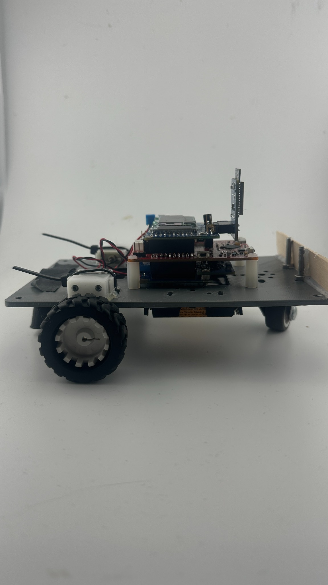
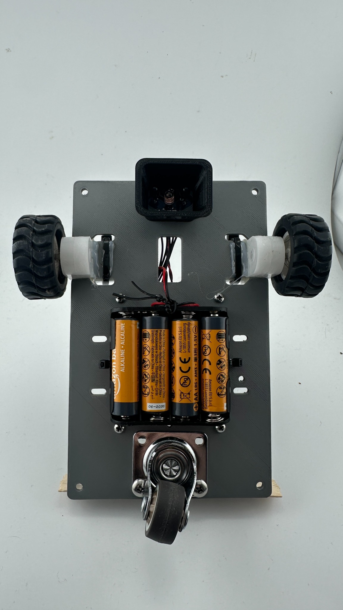
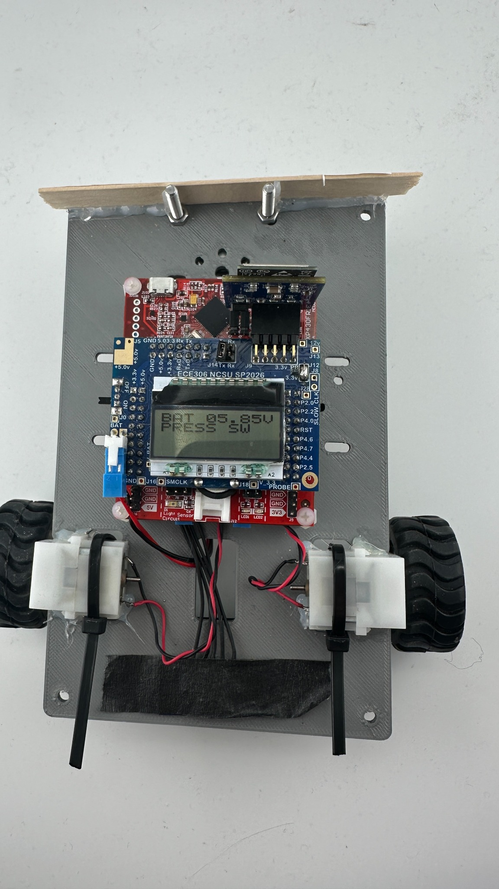
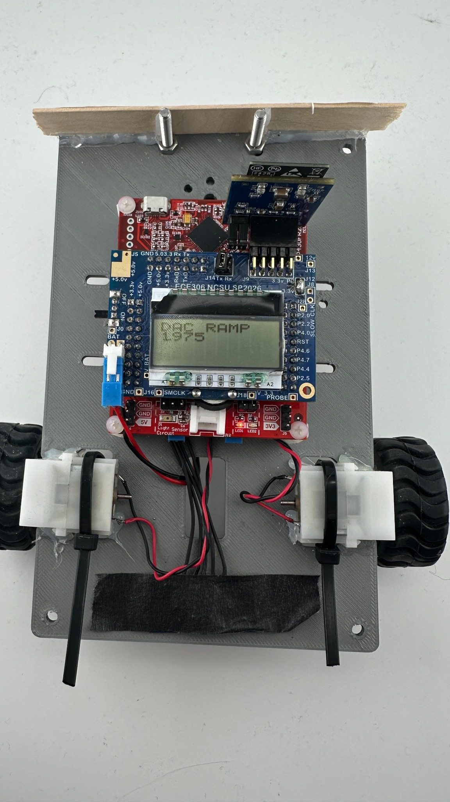
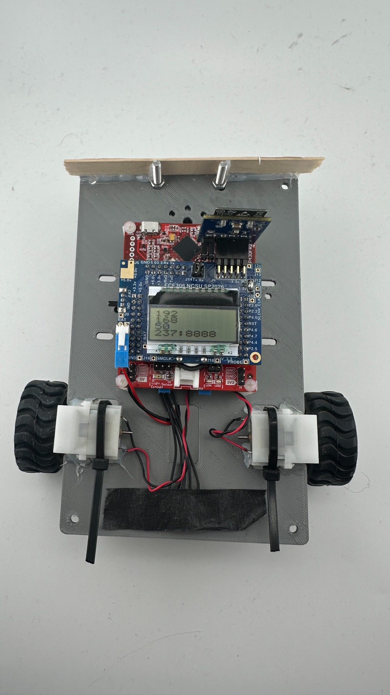
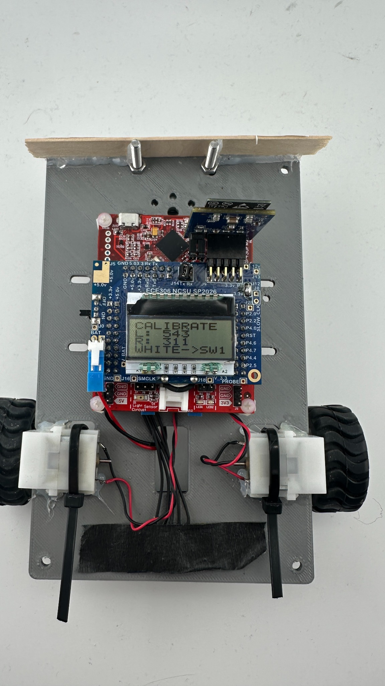
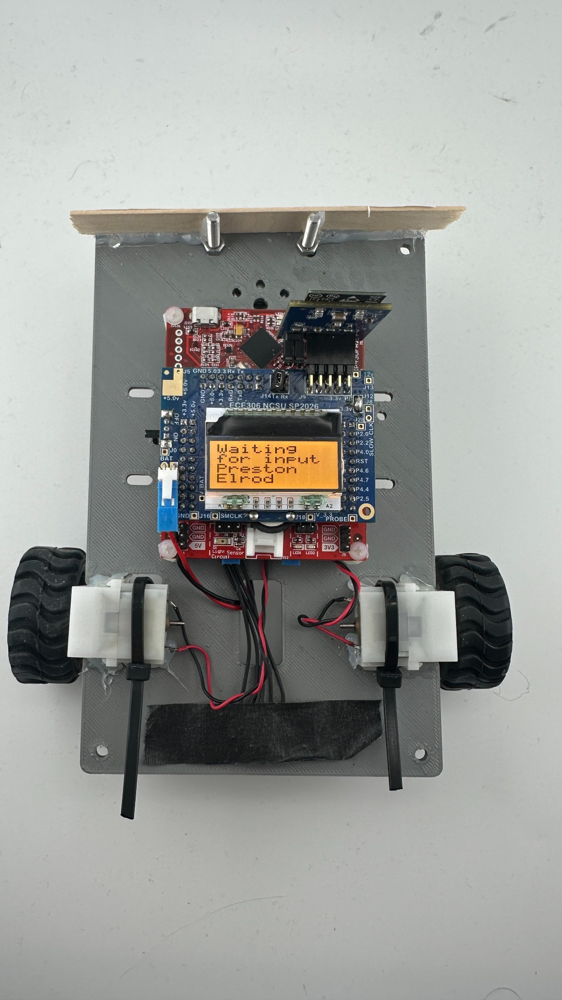
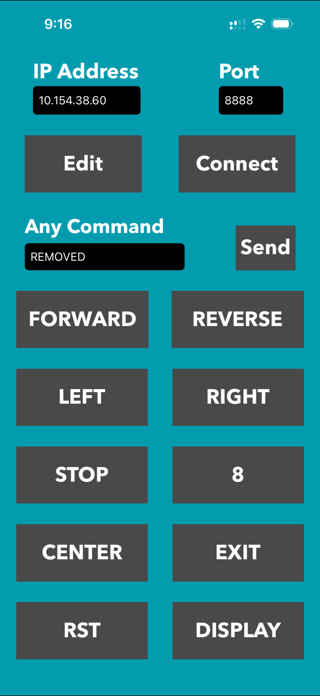

# ECE306 SPR26 IOT Line-Following Car

> MSP430FR2355-based IOT robot car for the NCSU ECE306 SPR26 course. The car completed the course on the first try.

## Project Snapshot

This project runs an MSP430FR2355 line-following car with LCD feedback, ESP-based Wi-Fi control, calibrated IR line detection, motor PWM control, DAC-assisted motor power stabilization, and a command-driven autonomous course coordinator.

| Area | Summary |
|---|---|
| Course | NCSU ECE306 SPR26 |
| MCU | MSP430FR2355 |
| Control | ESP IOT app over TCP, port `8888` |
| Display | 4-row x 10-column DOGS104-A style LCD |
| Sensors | Calibrated left/right IR line sensors |
| Drive | Independent rear-wheel PWM motor control |
| Main autonomous mode | Pad 8 black-line intercept, travel, and circle follow |

## Contents

- [Visual Overview](#visual-overview)
- [Quick Start](#quick-start)
- [IOT App Button Setup](#iot-app-button-setup)
- [IOT Command Reference](#iot-command-reference)
- [Pad 8 Autonomous Sequence](#pad-8-autonomous-sequence)
- [Program Flow](#program-flow)
- [Feature Overview](#feature-overview)
- [Project File Map](#project-file-map)
- [Hardware and Debug Notes](#hardware-and-debug-notes)
- [Image Asset Names](#image-asset-names)

## Visual Overview

The robot uses a flat chassis plate with two rear drive wheels, a front caster, a battery holder, a stacked MSP430 control board, an ESP-based IOT module, and a front-mounted sensor housing.

<table>
  <tr>
    <td align="center" width="50%">
      <br>
      <sub>Side profile: low chassis, rear drive wheel, front caster, stacked control board, and raised IOT module.</sub>
    </td>
    <td align="center" width="50%">
      <br>
      <sub>Underside/front view: battery pack, rear motor layout, caster wheel, wiring, and front sensor housing.</sub>
    </td>
  </tr>
</table>

## Quick Start

Follow this order when starting the car for the course.

### 1. Power on the car

When the car first powers on, it displays battery voltage and waits for switch input before continuing.

<p align="center">
  
</p>

Charge or replace the battery if the displayed voltage is near **4.5 V**. The 16 MHz setup is more sensitive to voltage drops than a lower-speed clock setup.

### 2. Wait for DAC ramp

After the startup prompt, the car enters the DAC ramp state.

<p align="center">
  
</p>

The DAC ramp helps stabilize the motor power/reference behavior before motor-heavy work begins.

### 3. Wait for IOT setup

After the DAC ramp finishes, the ESP IOT module connects to Wi-Fi and starts the TCP server.

<p align="center">
  
</p>

The LCD shows the IP/server information. In the example image, the car is using port `8888`.

### 4. Calibrate the sensors

After IOT setup, the car enters sensor calibration mode.

<p align="center">
  
</p>

Use the switch prompts to capture the white and black sensor readings. These values are used by the line-following logic and by command conditions such as `BLACK`, `BLACK100`, `WHITE`, and `WHITE100`.

### 5. Wait for input

After calibration is complete, the car enters the ready state.

<p align="center">
  
</p>

At this point, the robot is ready to receive commands from the IOT app.

### 6. Connect the IOT app

Open the IOT app and enter the IP address and port shown on the car LCD.

<p align="center">
  
</p>

Example connection:

```text
IP Address: 10.154.38.60
Port: 8888
```

After connecting, send the configured authorization password if required by the code. Once authorized, the saved buttons can send manual movement commands, reset commands, display commands, and autonomous command sequences.

## IOT App Button Setup

The app uses saved buttons to send command strings to the robot. Manual movement buttons use `M(left,right,~)` so the car continues moving until another command, condition, or stop command ends the motion.

| App Button | Command to Send | Purpose |
|---|---|---|
| `FORWARD` | `M(+30,+25,~)` | Drives forward continuously. |
| `REVERSE` | `M(-30,-25,~)` | Drives backward continuously. |
| `LEFT` | `M(-30,+25,~)` | Tank-turns left continuously. |
| `RIGHT` | `M(+30,-25,~)` | Tank-turns right continuously. |
| `STOP` | `STOP` | Stops the active command and stops both motors. |
| `CENTER` | `BLKFL` | Starts black-line-follow mode. |
| `RST` | `RST` | Resets the command/course state. |
| `DISPLAY` | `PR(Arrived 07)` | Displays the pad 7 arrival message. |
| `8` | See [Pad 8 Autonomous Sequence](#pad-8-autonomous-sequence) | Runs the pad 8 autonomous black-line sequence. |

## IOT Command Reference

Commands are received from the authorized IOT app connection and are processed as comma- or semicolon-separated tokens.

### Print commands

`PR(text)` prints text to the top LCD row.

```text
PR(Arrived 07)
PR(Arrived 08)
PR(BL Start)
PR(Intercept)
PR(BL Turn)
PR(BL Travel)
PR(BL Circle)
PR(BL Exit)
PR(BL Stop)
```

### Pause commands

`PA1000` pauses with motors off for the selected number of milliseconds.

```text
PA1000
PA5000
PA10000
```

### Motor commands

`M(left,right,ms)` runs explicit left and right motor percentages for a duration.

```text
M(+30,+25,2000)
M(+35,-35,600)
M(-30,-25,1000)
```

`M(left,right,~)` holds the motor command until another command or condition ends it.

```text
M(+30,+25,~)
M(-30,-25,~)
M(-30,+25,~)
M(+30,-25,~)
```

Motor command format:

```text
M(left_pwm,right_pwm,time)
```

Rules:

- Positive PWM drives that side forward.
- Negative PWM drives that side reverse.
- `0` stops that side.
- A number in the time field runs the command for that many milliseconds.
- `~` holds the command until the next condition, stop, or replacement command.

### Simple movement commands

The command coordinator also supports simple movement commands.

```text
F1000
B1000
L500
R500
F~
B~
L~
R~
```

### Sensor wait commands

Sensor wait commands use the calibrated white and black readings.

```text
BLACK
BLACK100
WHITE
WHITE100
```

Examples:

```text
M(+35,+45,~),WHITE
M(+32,+25,~),BLACK100
```

`BLACK100` waits for a black threshold with an added sensitivity offset. `WHITE100` waits for a white threshold with an added sensitivity offset.

### Black-line-follow commands

Black-line-follow commands start the follow addon.

```text
BLKFL
BLKFL10000
BLKFL~
```

Behavior:

- `BLKFL` starts black-line-follow mode.
- `BLKFL10000` follows the black line for `10000` ms.
- `BLKFL~` follows the black line until another command ends it.

### Stop and reset commands

```text
STOP
S
RST
RESET
```

`STOP` and `S` stop the current course command and stop both motors. `RST` and `RESET` reset the course display, timer, command buffer, and command state.

## Pad 8 Autonomous Sequence

The pad 8 button sends this full command string:

```text
PR(Arrived 08),PA10000,PR(BL Start),M(+30,+25,2000),M(+35,+45,~),WHITE,PA10000,M(+32,+25,~),BLACK100,PR(Intercept),PA10000,PR(BL Turn),M(+35,-35,600),PA10000,PR(BL Travel),BLKFL10000,PR(BL Circle),PA10000,BLKFL~
```

| Step | Command | Behavior |
|---:|---|---|
| 1 | `PR(Arrived 08)` | Displays arrival at pad 8. |
| 2 | `PA10000` | Waits 10 seconds for TA confirmation. |
| 3 | `PR(BL Start)` | Displays the black-line start state. |
| 4 | `M(+30,+25,2000)` | Drives forward for 2 seconds. |
| 5 | `M(+35,+45,~),WHITE` | Keeps driving until the sensors see white. |
| 6 | `PA10000` | Waits 10 seconds. |
| 7 | `M(+32,+25,~),BLACK100` | Drives until the black line is detected. |
| 8 | `PR(Intercept)` | Displays the intercept state. |
| 9 | `PA10000` | Waits 10 seconds. |
| 10 | `PR(BL Turn)` | Displays the turn state. |
| 11 | `M(+35,-35,600)` | Performs a timed tank turn. |
| 12 | `PA10000` | Waits 10 seconds. |
| 13 | `PR(BL Travel)` | Displays the travel state. |
| 14 | `BLKFL10000` | Follows the black line for 10 seconds. |
| 15 | `PR(BL Circle)` | Displays the circle state. |
| 16 | `PA10000` | Waits 10 seconds. |
| 17 | `BLKFL~` | Continues black-line-following until another command is sent. |

## Program Flow

`main.c` runs a simple startup and control state machine.

```text
Init Core
   ↓
DAC Ramp
   ↓
IOT Setup
   ↓
Sensor Calibration
   ↓
Command Coordinator
```

1. **Init Core:** Initializes ports, clocks, ADC, timers, serial, LCD, display, interrupts, motors, and shows battery voltage.
2. **DAC Ramp:** Starts the DAC subsystem and waits for the DAC ramp to finish before motor-heavy work begins.
3. **IOT Setup:** Resets and configures the ESP module until Wi-Fi, TCP server, and app authorization are ready.
4. **Calibrate Sensor:** Uses switch input and detector readings to capture white and black sensor calibration values.
5. **Command Coordinator:** Runs IOT receive handling, detector updates, command parsing, motor tasks, and display updates.

## Feature Overview

- **Main startup sequence:** `main.c` starts in a safe, low-power programming-friendly state so the processor can be flashed without turning on the battery, then steps through core initialization, DAC ramp, IOT setup, sensor calibration, and command coordination.
- **Cooperative task loop:** The main loop gives CPU time to each active task in order instead of blocking permanently inside one subsystem.
- **16 MHz CPU speed:** The MSP430 is configured for a 16 MHz MCLK with an 8 MHz SMCLK so the robot has enough processing headroom for IOT, LCD, sensor, and motor work.
- **Battery voltage warning:** If the battery reads around **4.5 V**, replace or recharge it because 16 MHz operation is more sensitive to voltage dips than the default lower-speed clock setup.
- **Precise system timing:** `system_ticks_ms` provides a millisecond timebase used for debounce, display updates, command timing, IOT retry timing, line-follow timing, and non-blocking delays.
- **Responsive switch inputs:** SW1 and SW2 are handled through interrupts with debounce timing and short backlight blink feedback so button presses are visible and responsive.
- **Custom LCD SPI driver:** The LCD driver was built custom from online reference material because the original/reference LCD behavior was not reliable enough after the 16 MHz clock change.
- **DAC power stabilization:** The DAC subsystem ramps and settles the motor power/reference behavior before the course starts so the drive system is more stable.
- **Motor driver:** The motor layer uses global requested state/speed values, then applies them through `Motor_Task()` to keep motor commands centralized and predictable.
- **Serial mirror debugging:** The serial system mirrors IOT module traffic to USB so ESP commands, responses, and app communication can be watched from a terminal.
- **IOT boot sequence:** The ESP setup state machine resets the module, sends the AT setup sequence, joins Wi-Fi, opens the TCP server, and falls back from Wi-Fi slot 1 to Wi-Fi slot 2 if needed.
- **IOT status indication:** LEDs and LCD/backlight behavior show connection, authorization, RX activity, and TX activity without needing a debugger.
- **Line following addon:** The follow addon uses calibrated left/right IR readings to drive forward, correct left/right, or search for the line.
- **Command addon:** The command coordinator parses app commands such as print, motor, pause, movement, black-line-follow, wait-for-black/white, stop, and reset commands.

## Project File Map

<details>
<summary><strong>Core files</strong></summary>

| File | Purpose |
|---|---|
| `Core/core.h` | Includes the core project interfaces used by `main.c`. |
| `Core/lib/adc.h` | Defines ADC channels, battery divider values, and ADC read prototypes. |
| `Core/lib/dac.h` | Defines DAC ramp values, DAC globals, and DAC function prototypes. |
| `Core/lib/display.h` | Exposes the buffered LCD display helper functions. |
| `Core/lib/functions.h` | Keeps legacy project prototypes available for compatibility. |
| `Core/lib/init.h` | Exposes the full-board initialization routine. |
| `Core/lib/interupt.h` | Defines interrupt timing constants, switch flags, system ticks, and backlight helpers. |
| `Core/lib/iot.h` | Defines ESP Wi-Fi credentials, IOT timing values, message buffers, status globals, and IOT APIs. |
| `Core/lib/LCD.h` | Defines the low-level DOGS104-A LCD driver interface and legacy LCD symbols. |
| `Core/lib/macros.h` | Stores shared timing, state, reset, and PWM macros. |
| `Core/lib/motor.h` | Defines motor direction states, PWM tuning values, requested motor globals, and motor APIs. |
| `Core/lib/ports.h` | Maps MSP430 port bits to board signals and declares port initialization functions. |
| `Core/lib/serial.h` | Defines UCA0/UCA1 ring buffers, legacy IOT buffers, baud selection, and serial APIs. |
| `Core/lib/timers.h` | Exposes TimerB0 and TimerB3 initialization. |
| `Core/lib/utils.h` | Exposes simple string-formatting helpers for display output. |
| `Core/src/adc.c` | Configures the ADC and provides blocking raw/millivolt channel reads. |
| `Core/src/clocks.c` | Configures the 16 MHz clock system and DCO trim. |
| `Core/src/dac.c` | Configures the SAC3 DAC and runs the DAC ramp logic. |
| `Core/src/display.c` | Manages four fixed-width LCD display rows and refresh requests. |
| `Core/src/init.c` | Calls the board initialization functions in the required startup order. |
| `Core/src/interupt.c` | Implements switch interrupts, debounce, backlight pulse timing, display timing, detector request timing, DAC overflow handling, and `system_ticks_ms`. |
| `Core/src/iot.c` | Implements the ESP AT-command setup state machine, Wi-Fi fallback, TCP server setup, app authorization, RX parsing, and IOT status feedback. |
| `Core/src/LCD.c` | Implements the custom DOGS104-A SPI LCD driver and compatibility functions required by older display code. |
| `Core/src/motor.c` | Applies requested motor globals to TimerB3 PWM outputs with minimum PWM and wheel-balance offset handling. |
| `Core/src/ports.c` | Configures all GPIO, ADC pins, UART pins, SPI pins, motor PWM pins, switch interrupts, and IOT control pins. |
| `Core/src/serial.c` | Implements UCA0/UCA1 serial drivers, ring buffers, TX interrupt handling, and USB mirroring of IOT traffic. |
| `Core/src/system.c` | Contains system-level helper behavior such as enabling interrupts. |
| `Core/src/timers.c` | Configures TimerB0 for system timing and TimerB3 for motor PWM. |
| `Core/src/utils.c` | Implements simple number-to-string formatting for display-safe output. |

</details>

<details>
<summary><strong>Addon files</strong></summary>

| File | Purpose |
|---|---|
| `Addon/lib/calibrate.h` | Defines calibration states, calibration globals, and calibration APIs. |
| `Addon/lib/command.h` | Exposes the command coordinator APIs used by the main command state. |
| `Addon/lib/detect.h` | Exposes detector raw values, detector request flag, and detector APIs. |
| `Addon/lib/follow.h` | Exposes the line follower initialization and task functions. |
| `Addon/lib/led.h` | Exposes LED initialization and legacy LED state-machine hooks. |
| `Addon/lib/line.h` | Exposes the line intercept/alignment sequence API. |
| `Addon/lib/shape.h` | Exposes the inactive legacy shape-motion demo API. |
| `Addon/src/calibrate.c` | Captures white and black sensor readings through a switch-driven calibration state machine. |
| `Addon/src/command.c` | Parses and executes IOT app commands, manages course timing, waits on detector conditions, updates LCD status, and coordinates motors/follow behavior. |
| `Addon/src/detect.c` | Samples the left and right IR detector ADC channels and stores averaged raw readings. |
| `Addon/src/follow.c` | Uses calibrated detector values to run a constant-speed black-line follower. |
| `Addon/src/led.c` | Implements LED strobe behavior using the system millisecond tick. |
| `Addon/src/line.c` | Implements a robust non-PID line intercept and alignment sequence. |
| `Addon/src/shape.c` | Contains an inactive legacy timed-motion script kept for reference. |

</details>

## Hardware and Debug Notes

- The ESP IOT module uses UCA0, while USB debugging uses UCA1.
- The LCD is a four-row, ten-column DOGS104-A style display driven through the custom SPI implementation.
- The app must send the configured authorization password before movement commands are accepted.
- Wi-Fi slot 1 is intended for the school network, while Wi-Fi slot 2 is intended for a personal backup network.
- Red/green IOT LEDs pulse for TX/RX activity and show connection status during setup.
- The LCD/backlight status gives visible feedback during startup, authorization, switch presses, and command execution.
- The front sensor housing helps reduce external light interference during line detection.
- The rear drive wheels are controlled independently, allowing forward motion, reverse motion, and tank turns.
- The front caster provides passive support while the rear wheels provide all driven motion.

## Image Asset Names

Place these image files in an `images/` folder next to `README.md`.

| Image file | Used for |
|---|---|
| `images/car_side_profile.jpg` | Side profile of the complete car. |
| `images/car_underside_drive_base.jpg` | Underside/front view showing drive base and sensor housing. |
| `images/startup_01_battery_switch_prompt.jpg` | Battery voltage and switch prompt. |
| `images/startup_02_dac_ramp.jpg` | DAC ramp startup state. |
| `images/startup_03_iot_ip_display.jpg` | IOT IP/server display. |
| `images/startup_04_sensor_calibration.jpg` | Sensor calibration screen. |
| `images/startup_05_waiting_for_input.jpg` | Ready/waiting-for-input screen. |
| `images/iot_app_button_layout.png` | IOT app saved button layout. |

